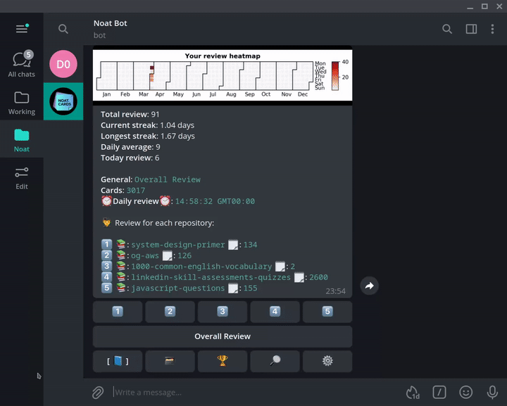

# [Noatcards](https://noat.cards)

noatcards is simple spaced repetition learning platform based on telegram(bot). the platform has feature call quiz competition game which you can create quiz game and play with your friend. 
you can use the repo to create a quiz library in `noat.cards` and create some quiz games to test your knowledge yourself or have fun with your friends.

## How to use the repo with `noat.cards`

### Import the repository to `noat.cards`**

- Access to the [bot](https://telegram.me/noat_cards_bot?start)
- Input command `/start` or `/home` start Main UI of the bot
- Navigate to `🗃` (Repo Shelf) by click on `🗃` button
- Select `Import Repo 📥` (Import Repository with git url)
- Input the repo git url.
  `https://github.com/noatcards/javascript-questions`
  
### Practice quiz

- Navigate to `🗃` (Repo Shelf) by click on `🗃` button
- On `🗃` (Repo Shelf) tab,
  
  select `javascript-questions` by click on its index button
- select Quiz Test, you want to practice. 
- Click on button `Learn it` to start practice the quiz test